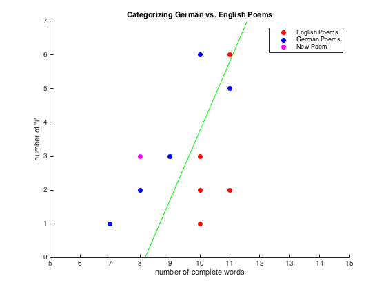

### SVM Poem Categorization

Small assignment to test uses of support vector machines in categorizing excerpts of poems in different languages. The ten poems used here are in English and German. The excerpts used were all less than or equal to 50 characters (to include full words only).

The categorization of the poems is based on the number of words in each excerpt and the number of times the letter 'i' occurs.

The original ten poems can be seen plotted in red and blue (for English and German respectively). A new test poem is then plotted in magenta. This poem is German so it appears the SVM works correctly since it is placed on the correct side.

This was work from Tufts' MATH-150 course (Spring 2016).
